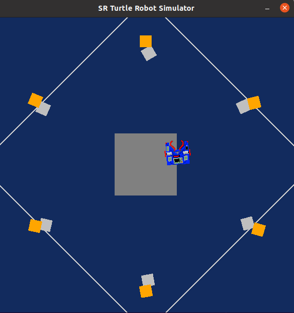

Python Robotics Simulator
================================

This is a simple, portable robot simulator developed by [Student Robotics](https://studentrobotics.org).
Some of the arenas and the exercises have been modified for the Research Track I first assignment

In this configuration, the robot should arrange the silver and golden tokens such that all silver tokens and placed next to the golden ones.
The initial set-up look like in the picture below: 


The final result or set-up should look like the picture below:





To obtain this result, this Readme file is organized as such: 

* Installing and running
  * Dependencies
  * Running from shell
* Robot API
  * Motors
  * The Grabber 
  * Vision
* Pseudocode
  * Functions used 
  * Functions pseudocodes


Installing and running
----------------------

### Dependencies ###

The simulator requires a Python 2.7 installation, the [pygame](http://pygame.org/) library, [PyPyBox2D](https://pypi.python.org/pypi/pypybox2d/2.1-r331), and [PyYAML](https://pypi.python.org/pypi/PyYAML/).


### Running from shell ###
-----------------------------

The program is run with:

```bash
$ python run.py IH_assignment.py
```

Robot API
---------

The API for controlling a simulated robot is designed to be as similar as possible to the [SR API][sr-api].

### Motors ###

The simulated robot has two motors configured for skid steering, connected to a two-output [Motor Board](https://studentrobotics.org/docs/kit/motor_board). The left motor is connected to output `0` and the right motor to output `1`.

The Motor Board API is identical to [that of the SR API](https://studentrobotics.org/docs/programming/sr/motors/), except that motor boards cannot be addressed by serial number. So, to turn on the spot at one quarter of full power, one might write the following:

```python
R.motors[0].m0.power = 25
R.motors[0].m1.power = -25
```

### The Grabber ###

The robot is equipped with a grabber, capable of picking up a token which is in front of the robot and within 0.4 metres of the robot's centre. To pick up a token, call the `R.grab` method:

```python
success = R.grab()
```

The `R.grab` function returns `True` if a token was successfully picked up, or `False` otherwise. If the robot is already holding a token, it will throw an `AlreadyHoldingSomethingException`.

To drop the token, call the `R.release` method.

Cable-tie flails are not implemented.

### Vision ###

To help the robot find tokens and navigate, each token has markers stuck to it, as does each wall. The `R.see` method returns a list of all the markers the robot can see, as `Marker` objects. The robot can only see markers which it is facing towards.

Each `Marker` object has the following attributes:

* `info`: a `MarkerInfo` object describing the marker itself. Has the following attributes:
  * `code`: the numeric code of the marker.
  * `marker_type`: the type of object the marker is attached to (either `MARKER_TOKEN_GOLD`, `MARKER_TOKEN_SILVER` or `MARKER_ARENA`).
  * `offset`: offset of the numeric code of the marker from the lowest numbered marker of its type. For example, token number 3 has the code 43, but offset 3.
  * `size`: the size that the marker would be in the real game, for compatibility with the SR API.
* `centre`: the location of the marker in polar coordinates, as a `PolarCoord` object. Has the following attributes:
  * `length`: the distance from the centre of the robot to the object (in metres).
  * `rot_y`: rotation about the Y axis in degrees.
* `dist`: an alias for `centre.length`
* `res`: the value of the `res` parameter of `R.see`, for compatibility with the SR API.
* `rot_y`: an alias for `centre.rot_y`
* `timestamp`: the time at which the marker was seen (when `R.see` was called).

For example, the following code lists all of the markers the robot can see:

```python
markers = R.see()
print "I can see", len(markers), "markers:"

for m in markers:
    if m.info.marker_type in (MARKER_TOKEN_GOLD, MARKER_TOKEN_SILVER):
        print " - Token {0} is {1} metres away".format( m.info.offset, m.dist )
    elif m.info.marker_type == MARKER_ARENA:
        print " - Arena marker {0} is {1} metres away".format( m.info.offset, m.dist )
```

[sr-api]: https://studentrobotics.org/docs/programming/sr/

Pseudocode
---------

### Functions used ### 

The structure of the program is organized as such, with functions and a main block: 
* `main()`: this is the main loop which calls the functions listed below to arrange the silver and golden tokens such that all silver tokens and placed next to the golden ones
* `drive()`: drive forward/backward at a specific speed and delay
* `turn()`: turn right/left at a specific speed and delay
* `find_silver_token()`: function to find the closest silver token 
* `find_golden_token()`: function to find the closest golden token 
* `grab_silver_token()`: function to track and grab the silver token
* `reach_golden_token()`: function to track golden token
* `main()`: main block, arrange the silver and golden tokens such that all silver tokens and placed next to the golden

### Functions Pseudocodes ###

***drive() Pseudocode***

  drive forward with set speed

  delay for a set of seconds

***turn() Pseudocode***

turn left or right with set speed 

delay for a set of seconds

***find_silver_token() Pseudocode***

initialize dist to 100

For every token seen by robot
    
    If token distance is less than dist and type of token is silver 
     
      input distance of token to dist 
     
      input rotation about the Y of token to rot_y
     
      input code of token to tcode
   
   EndIf 
    
    If distance is higher than dist 
      
      input -1 to dist 
     
      input -1 to rot_y
      
      input -1 to tcode
      
      exit function
    
    EndIf

EndFor

***find_golden_token() Pseudocode***

initialize dist to 100

For every token seen by robot
    
    If token distance is less than dist and type of token is golden 
      
      input distance of token to dist 
      
      input rotation about the Y of token to rot_y
      
      input code of token to tcode
    
    EndIf 
    
    If distance is higher than dist 
      
      input -1 to dist 
      
      input -1 to rot_y
      
      input -1 to tcode
      
      exit function
    
    EndIf

EndFor

***grab_silver_token Pseudocode***


initialize check to 0

While check is equal to 0
    
    call find_siler_token 
    
    If code of token is not in the list of already organized silver tokens
        
        If distance of silver token is equal to -1 
            
            print "I don't see any SILVER token!!"
            
            call turn with speed +10 and delay 1 
        
        ElIf distance of silver token is less than the threshold distance
            
            print "Found you Mr.Silver!"
            
            If grab call is successful 
                
                add code of the silver token to the list of already organized silver tokens
                
                print "Gotcha, Silver!, right direction and right orientation"
                
                set check to 1 
            
            Else 
                
                print "Aww, I'm not close enough."
        
        ElIf the y rotation of silver token is less than the +threshold distance and higher than the -threshold distance
                
                print "Ah, that'll do."
                
                call drive with speed of 10 and delay of 0.5
        
        ElIf the y rotation of silver token is less than the -threshold 
                
                print "Left a bit..."
                
                call turn with speed of -2 and delay of 0.5
        
        ElIf the y rotation of silver token is higher than the +threshold
                
                print "Right a bit..."
                
                call turn with speed of +2 and delay of 0.5
        
        EndIf
    
    Else 
        
        set check to 0
        
        call turn with speed of +10 and delay of 1
        
        print "Silver Token already dealt with, keep looking!"
    
    EndIf

EndWhile

***reach_golden_token() Pseudocode***

initialize check to 0

While check is equal to 0
    
    call find_golden_token 
    
    If code of token is not in the list of already organized golden tokens
        
        If distance of golden token is equal to -1 
            
            print "I don't see any GOLDEN token!!"
            
            call turn with speed +10 and delay 1 
        
        ElIf distance of golden token is less than the threshold distance
            
            print "Found you Mr.Golden!"
            
            set check to 1
            
            add code of the golden token to the list of already organized golden tokens
        
        ElIf the y rotation of golden token is less than the +threshold distance and higher than the -threshold distance
                
                print "Ah, that'll do."
                
                call drive with speed of 20 and delay of 0.5
        
        ElIf the y rotation of golden token is less than the -threshold 
                
                print "Left a bit..."
                
                call turn with speed of -2 and delay of 0.5
        
        ElIf the y rotation of golden token is higher than the +threshold
                
                print "Right a bit..."
                
                call turn with speed of +2 and delay of 0.5
        
        EndIf
    
    Else 
        
        set check to 0
        
        call turn with speed of +12 and delay of 1
        
        print "Golden Token already dealt with, keep looking!"
    
    EndIf

EndWhile

***main() Pseudocode***

initialize Threshold for the control of the linear distance to 2.0

initialize Threshold for the control of the orientation to 0.4

initialize silver to True 

initialize round counter to 1 

initialize the total list of silver and golden to 0

initialize check to 0

print "First thing first, lemme get to the center!"

call drive with speed of 200 and delay of 3

While the total list of silver and golden is less than 10 elements 
    
    call grab_silver_token
    
    call reach_golden_token
    
    release token
    
    print "Token released"
    
    call drive with speed of -100 and delay of 1.5
    
    call turn with speed of +4 and delay of 1
    
    update the total list of silver and golden from the list of already organized golden tokens and from the list of already organized silver tokens
    
    print the total number of already organized silver tokens at i round 
    
    print the list of already organized silver tokens at i round 
    
    print the total number of already organized golden tokens at i round 
    
    print the list of already organized golden tokens at i round 
    
    print the total number of already organized tokens
    
    increment i with 1

EndWhile

print "Mission Accomplished!"


